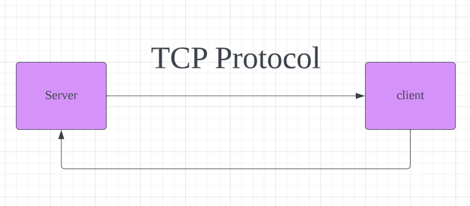

# Desert Messenger
아무리 대화해도 흔적이 남지 않는 메신저, Desert Messenger
- https://www.youtube.com/watch?v=ph0J3TGYqgs&t=1s

# 기능 
- CLI를 이용해 서로 통신을 할 수 있습니다.
- 서로간의 대화를 기록을 및 흔적을 남기지 않기 때문에 무흔적(無痕跡)을 제공합니다.

# 기술 스택 
C, Pthread, Mutex, socket(TCP protocol)

# 내부 구조 원리 
- Dessert Messenger의 flow는 다음과 같습니다.

- 동시성 처리는 Mutex를 해결했습니다.
- 서로의 네트워킹은 TCP Protocol를 이용했습니다.

# 무슨 이유로 개발하게 되었나요? 
Desert Messenger는 아무리 걸어도 발자국이 없어지는 사막의 특성 중 하나인 흔적이 사라진다는 점을 착안해 서로 대화의 기록이 남지 않고 흔적이 남지 않는 메신저를 개발하고 싶어 개발된 프로젝트 입니다. 

# 알게 된 점은 무엇인가요?
- C언어는 생각보다 대단한 언어이고 무엇이든 할 수 있는 언어이구나
- 네트워킹을 구현하려면 TCP protocol와 Socket를 이용하면 되는구나!
- 쓰레드에 대해서 알게되었다! (C언어는 pthread를 사용하는구나!)
- 동시성 처리는 Mutex라는 것으로 해결 할 수 있구나!

